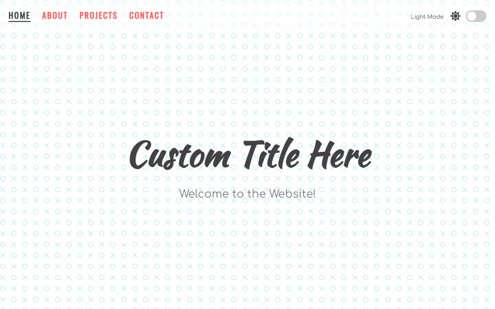

# Light & Dark Mode | ZTM JS Web Projects Course

**Project 5/20**

🌓 A responsive single-page website that allows users to switch between light and dark themes dynamically, with visual transitions and themed illustrations.

---

## 📚 Table of Contents

- [🔎 Overview](#-overview)
  - [📸 Screenshot](#-screenshot)
  - [🔗 Links](#-links)
  - [📌 Features](#-features)
- [🧠 My process](#-my-process)
  - [🛠️ Built with](#️-built-with)
  - [🎓 What I learned](#-what-i-learned)
  - [🔙 Previous Project](#-previous-project)
  - [🔜 Next Project](#-next-project)
  - [🗃️ Useful resources](#️-useful-resources)
- [👤 Author](#-author)
  - [🌐 Connect with Me](#-connect-with-me)
  - [💻 Coding Profiles](#-coding-profiles)

---

## 🔎 Overview

### 📸 Screenshot

### 🔗 Links

 - [🔴 Live Demo](https://dalascript.github.io/light-and-dark-mode/)
 - [🗂️ GitHub Repository](https://github.com/DalaScript/light-and-dark-mode)

### 📌 Features

 - ✅ Toggle between light and dark themes
 - ✅ Navigation and content section adapts to selected theme
 - ✅ Images switch dynamically to match the theme
 - ✅ Theme preference saved in localStorage
 - ✅ Stylish animated toggle switch

---

## 🧠 My Process

### 🛠️ Built with

 - HTML5
 - CSS3
 - Vanilla JavaScript
 - LocalStorage

### 🎓 What I Learned

 - How to implement dark/light theme toggling using JavaScript
 - How to store user preferences with `localStorage`
 - Dynamically changing images and styles based on theme
 - Working with CSS variables for easy theme management

  > 🚀 For me, this project was more about **practice** and gaining additional **experience**,  
  > rather than learning something entirely new.  
  >  
  > 👨‍💻 Since I’m not a beginner and already familiar with these technologies,  
  > I approached it with confidence — and still, I truly **enjoyed working on it**.  
  >  
  > 🎯 Overall, I consider this a very **valuable and enjoyable experience**.

### 🔙 Previous Project

 - Joke Teller | *[Project 4/20]* → [View Repository](https://github.com/DalaScript/joke-teller)

### 🔜 Next Project

 - Animated Template | *[Project 6/20]* → [View Repository](https://github.com/DalaScript/animated-template)

### 🗃️ Useful resources

 - [Google Fonts](https://fonts.google.com/) – Huge library of customizable web-safe fonts.
 - [FontAwesome Icons](https://fontawesome.com/icons?d=gallery&q=close&m=free) – Free and premium icon library for modern UIs.
 - [Hero Patterns](https://heropatterns.com/) – A collection of free, repeatable SVG background patterns.
 - [Undraw Illustrations](https://undraw.co/illustrations) – Open-source vector illustrations that adapt to your theme.
 - [W3Schools - Switch](https://www.w3schools.com/howto/howto_css_switch.asp) – Tutorial to build an animated toggle switch.
 - [W3Schools - Change Event](https://www.w3schools.com/jsref/event_onchange.asp) – Learn how to handle input and switch toggles in JS.
 - [MDN - CSS Variables](https://developer.mozilla.org/en-US/docs/Web/CSS/CSS_cascading_variables/Using_CSS_custom_properties) – How to define and use custom properties in CSS.
 - [MDN - Document Element](https://developer.mozilla.org/en-US/docs/Web/API/Document/documentElement) – Reference to access and modify the root element of the document.
 - [Dark Mode Colors How-to Article](https://blog.prototypr.io/how-to-design-a-dark-theme-for-your-android-app-3daeb264637) – Best practices for designing dark themes with readability in mind.
 

---

## 👤 Author

### 🌐 Connect with Me

 - [Instagram](https://www.instagram.com/DalaScript)
 - [YouTube](https://www.youtube.com/@DalaScript)

### 💻 Coding Profiles

 - [freeCodeCamp](https://www.freecodecamp.org/DalaScript)
 - [FrontendMentor](https://www.frontendmentor.io/profile/DalaScript)
 - [GitHub](https://github.com/DalaScript)

*🙌 Thanks for checking out my project! More coming soon. Stay tuned 🚀*